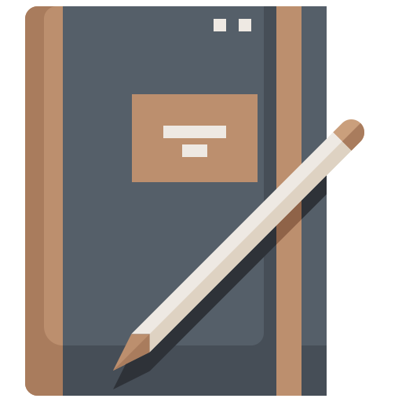

  

<h1 align="center">Personal Reflective Journal</h1>

## Table of contents

- [Table of contents](#table-of-contents)
- [About](#about)
- [Built with](#built-with)
- [License](#license)

## About

This repository contains my personal journal. Made with Markdown.

## Built with

## License

This project is licensed under the [MIT License](./LICENSE).

<a href="#readme-top"><strong>Back to top</strong></a>

